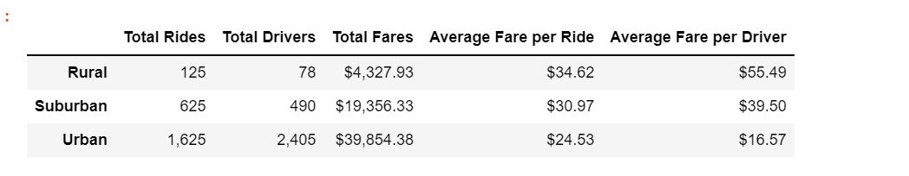
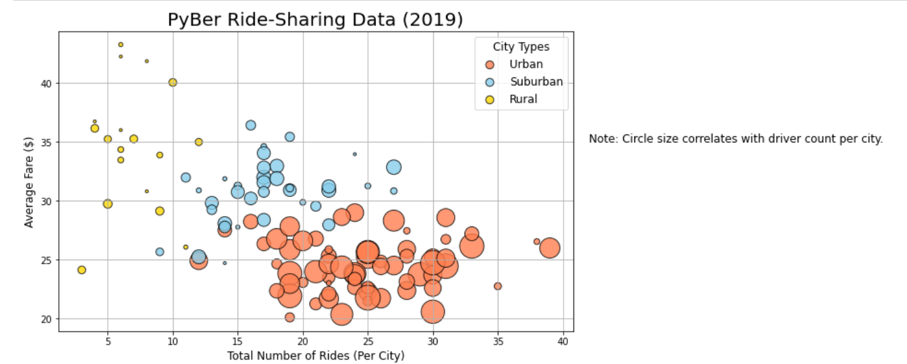
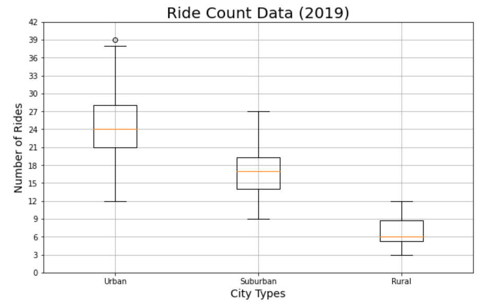
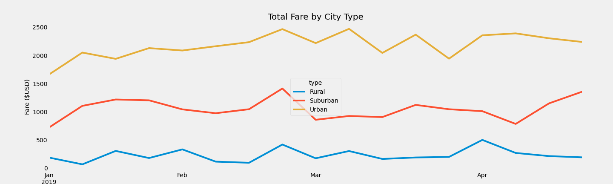

# PyBer_Analysis

## Overview

  This project was initiated as a way to analyze Pyber ride-share data.  Along with using the given data to create data frames, this project also incorporated data visulizations in the form of charts.

### Purpose
  
  The purpose of this new analysis is to compare fare, driver, and ride data in three different city types: rural, suburban, and urban.  To focus the data, this new analysis is displayed over a four month period, with fare totals summed weekly.
  
## Results
  
  Breaking the data down into city types: urban, suburban, and rural, the following results can be concluded:
  
  - Fare
    
    Depicted in the chart below, the average fare per ride in rural areas is almost ten dollors more than fares in urban areas.  The difference in average fare per driver is even greater when comparing the two, with fares per driver in rural areas being nearly 40 dollars higher than that of urban areas.  The suburban averages per ride and per driver remain in the middle of the rural and urban totals.
    
    
  - Driver Count
    
    As displayed in the following image, the amount of drivers in urban areas is vastly greater than the amount in rural areas. As with fare data, the suburban areas' driver counts once again fall into the middle of rural and urban areas driver totals.
    
    
  - Ride Count
    
    With the number of drivers being highest in urban areas and lowest in rural areas, it is no suprise that the same can be said for the amount of rides per city type.  The following image showcases the number of rides per city type, with average amount of rides for urban areas at twenty-four, suburban at seventeen, and rural at six.
    
    
  - Date

    The following chart displays total fare by city type, with dates ranging from January through April of 2019.  Two data points to consider are that all three city types have peaks in total fare around the end of February, and while both urban and suburban city types have a drop near the beginning of April, rural fares are higher, in contrast.
    
    
    
## Summary

  After analyzing the data and viewing data frames and charts, three recommendations can be made:
  
  - Balance Average Fare per Driver
    
    Drivers in rural areas are making almost forty dollars more per fare when compared to urban drivers. One can assume this is happening due to rural area drivers having to travel longer distances. A recommendation would be to have a minimum on short rides to increase revenue per ride for urban drivers 
    
  - Reassign Drivers on Peak Dates

    Considering that there is an increase in fare in rural areas at the beginning of April and a decrease in urban and suburban areas, a recommendation would be to assign urban and suburban drivers to targeted rural areas during that time.
    
  - Decrease Drivers

    The data displays that there are 2,405 total drivers for the urban areas, but only 1,625 rides were calculated.  This suggests that the urban areas are saturated with drivers, which could contribute to each driver making less money. 
    
    
  
  
